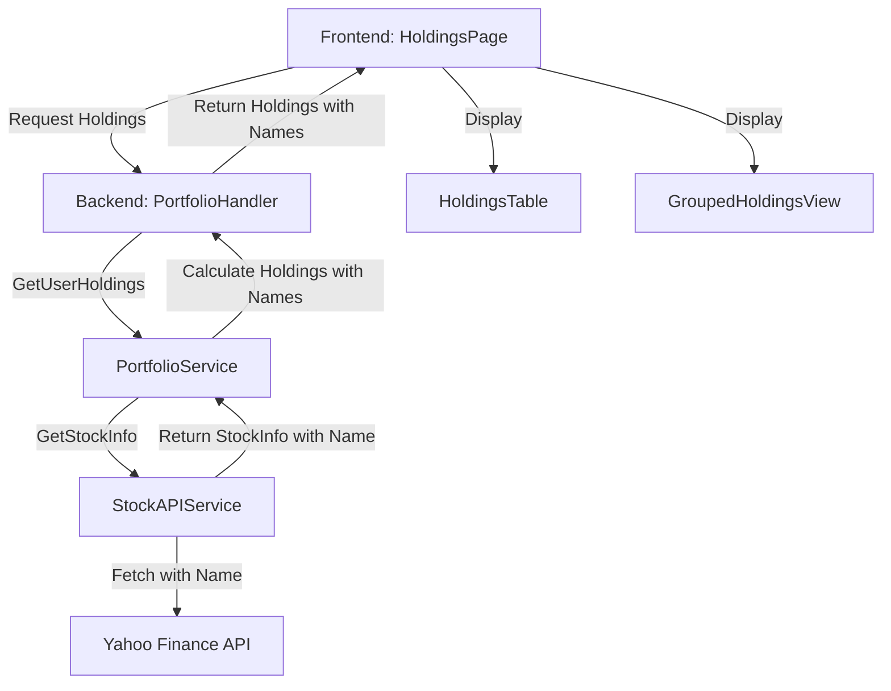

# Design Document - Stock Name Display

## Overview

本设计文档描述了如何在前端界面中展示股票名称而不仅仅是股票代码的实现方案。系统已经具备从 Yahoo Finance API 获取股票名称的能力（通过 `StockAPIService`），但前端目前只显示股票代码。本设计将扩展后端 API 响应以包含股票名称，并更新前端组件以展示这些信息。

## Architecture

### Current State

**后端架构：**
- `StockAPIService` 已经从 Yahoo Finance 获取股票名称（`longName` 或 `shortName`）
- `StockInfo` 结构体包含 `Name` 字段
- 股票信息已被缓存（5分钟）

**前端架构：**
- `Holding` 接口只包含 `symbol` 字段
- 组件（`HoldingsTable`, `GroupedHoldingsView`）只显示股票代码
- `StockInfo` 接口已包含 `name` 字段，但未在持仓视图中使用

### Proposed Changes



### Data Flow

1. 用户访问持仓页面
2. 前端请求 `/api/portfolio/holdings?currency=USD`
3. `PortfolioService.GetUserHoldings()` 为每个股票调用 `StockAPIService.GetStockInfo()`
4. `StockAPIService` 返回包含名称的 `StockInfo`
5. `PortfolioService` 在 `Holding` 结构中包含股票名称
6. 前端接收包含名称的持仓数据并显示

## Components and Interfaces

### Backend Changes

#### 1. Update Holding Structure (portfolio_service.go)

```go
// Holding represents a calculated portfolio holding
type Holding struct {
    PortfolioID     string  `json:"portfolioId,omitempty"`
    Symbol          string  `json:"symbol"`
    Name            string  `json:"name"`  // NEW: Stock name
    Shares          float64 `json:"shares"`
    CostBasis       float64 `json:"costBasis"`
    CurrentPrice    float64 `json:"currentPrice"`
    CurrentValue    float64 `json:"currentValue"`
    GainLoss        float64 `json:"gainLoss"`
    GainLossPercent float64 `json:"gainLossPercent"`
    Currency        string  `json:"currency"`
}
```

#### 2. Update calculateHolding Method

在 `calculateHolding()` 方法中，从 `StockInfo` 提取名称并添加到 `Holding` 结构：

```go
return &Holding{
    Symbol:          symbol,
    Name:            stockInfo.Name,  // NEW: Include stock name
    Shares:          totalShares,
    CostBasis:       convertedCostBasis,
    CurrentPrice:    convertedCurrentPrice,
    CurrentValue:    currentValue,
    GainLoss:        gainLoss,
    GainLossPercent: gainLossPercent,
    Currency:        targetCurrency,
}, nil
```

### Frontend Changes

#### 1. Update Holding Interface (HoldingsPage.tsx, GroupedHoldingsView.tsx)

```typescript
interface Holding {
  symbol: string;
  name?: string;  // NEW: Optional stock name
  shares: number;
  costBasis: number;
  currentPrice: number;
  currentValue: number;
  gainLoss: number;
  gainLossPercent: number;
  currency: string;
  portfolioId?: string;
}
```

#### 2. Update HoldingsTable Component

修改 `HoldingsTable.tsx` 以显示股票名称：

**选项 A: 名称优先，代码作为副标题**
```tsx
<td className="px-4 py-3 font-medium">
  <div className="flex items-center gap-2">
    {isCash && <Wallet className="h-4 w-4 text-muted-foreground" />}
    <div>
      <div className="font-medium">
        {isCash ? getCashDisplayName(holding.symbol) : (holding.name || holding.symbol)}
      </div>
      {!isCash && holding.name && (
        <div className="text-xs text-muted-foreground">{holding.symbol}</div>
      )}
    </div>
  </div>
</td>
```

**选项 B: 代码和名称并排显示**
```tsx
<td className="px-4 py-3">
  <div className="flex items-center gap-2">
    {isCash && <Wallet className="h-4 w-4 text-muted-foreground" />}
    <div>
      <div className="font-medium">{holding.symbol}</div>
      {!isCash && holding.name && (
        <div className="text-sm text-muted-foreground">{holding.name}</div>
      )}
    </div>
  </div>
</td>
```

推荐使用**选项 A**，因为它更符合用户需求（优先显示名称）。

#### 3. Update GroupedHoldingsView Component

类似地更新 `GroupedHoldingsView.tsx` 中的持仓显示：

```tsx
<td className="px-4 py-3 font-medium">
  <div>
    <div className="font-medium">{holding.name || holding.symbol}</div>
    {holding.name && (
      <div className="text-xs text-muted-foreground">{holding.symbol}</div>
    )}
  </div>
</td>
```

#### 4. Update Analytics API Types

更新 `web/src/api/analytics.ts` 中的 `Holding` 接口以包含 `name` 字段：

```typescript
export interface Holding {
  portfolioId?: string;
  symbol: string;
  name?: string;  // NEW
  shares: number;
  costBasis: number;
  currentPrice: number;
  currentValue: number;
  gainLoss: number;
  gainLossPercent: number;
  currency: string;
}
```

#### 5. Update Transaction Components

更新交易相关组件以显示股票名称：

- `TransactionDialog.tsx`: 在股票选择/显示时显示名称
- `TransactionsList.tsx`: 在交易列表中显示股票名称
- `WatchlistWidget.tsx`: 在观察列表中显示股票名称

## Data Models

### Backend Models

无需修改数据库模型。股票名称是动态获取的，不存储在数据库中。

### Frontend Models

```typescript
// web/src/api/analytics.ts
export interface Holding {
  portfolioId?: string;
  symbol: string;
  name?: string;  // Stock name from Yahoo Finance
  shares: number;
  costBasis: number;
  currentPrice: number;
  currentValue: number;
  gainLoss: number;
  gainLossPercent: number;
  currency: string;
}
```

## Error Handling

### Backend Error Handling

1. **股票名称获取失败**：
   - 如果 `StockAPIService.GetStockInfo()` 失败，整个持仓计算会失败
   - 当前行为：记录错误并跳过该持仓
   - 保持现有行为，因为没有价格信息就无法计算持仓价值

2. **名称为空**：
   - Yahoo Finance 可能返回空的 `longName` 和 `shortName`
   - `StockAPIService` 已经处理这种情况，会回退到使用 `symbol`
   - 前端也应该处理 `name` 为空或未定义的情况

### Frontend Error Handling

1. **名称缺失**：
   ```typescript
   const displayName = holding.name || holding.symbol;
   ```

2. **名称过长**：
   - 使用 CSS 截断长名称
   ```tsx
   <div className="font-medium truncate max-w-xs">
     {holding.name || holding.symbol}
   </div>
   ```

3. **加载状态**：
   - 持仓数据加载时显示骨架屏或加载指示器
   - 现有的 `loading` 状态已经处理这个问题

## Testing Strategy

### Backend Testing

1. **单元测试** (`portfolio_service_test.go`):
   - 测试 `calculateHolding()` 返回包含名称的 `Holding`
   - 测试名称为空时的回退行为
   - 测试现金持仓的名称处理

2. **集成测试**:
   - 测试 `/api/portfolio/holdings` 端点返回包含名称的数据
   - 测试不同市场股票（美股、中国股票）的名称获取

### Frontend Testing

1. **组件测试**:
   - 测试 `HoldingsTable` 正确显示股票名称
   - 测试名称缺失时显示股票代码
   - 测试现金持仓的特殊显示
   - 测试 `GroupedHoldingsView` 的名称显示

2. **集成测试**:
   - 测试 `HoldingsPage` 正确获取和显示包含名称的持仓数据

### Manual Testing Checklist

- [ ] 美股显示英文名称（例如：AAPL → Apple Inc.）
- [ ] 中国股票显示中文名称（例如：600519.SS → 贵州茅台）
- [ ] 现金持仓显示双语名称
- [ ] 名称过长时正确截断
- [ ] 名称缺失时显示股票代码
- [ ] 分组视图中正确显示名称
- [ ] 交易对话框中显示名称
- [ ] 观察列表中显示名称

## Performance Considerations

### Caching

- `StockAPIService` 已经缓存股票信息（包括名称）5分钟
- 前端不需要额外的缓存层，因为持仓数据在每次页面加载时重新获取
- 对于频繁访问的页面，可以考虑在前端添加短期缓存（例如：1分钟）

### API Call Optimization

- 当前实现：为每个持仓符号调用一次 `GetStockInfo()`
- 优化机会：批量获取股票信息（未来改进）
- 当前缓存机制已经减少了重复 API 调用

### Response Size

- 添加股票名称会增加响应大小
- 估计影响：每个持仓增加约 20-50 字节（取决于名称长度）
- 对于典型的 10-20 个持仓，增加约 200-1000 字节
- 影响可忽略不计

## UI/UX Considerations

### Display Format

**推荐格式（选项 A）：**
```
Apple Inc.
AAPL
```

优点：
- 名称更突出，符合用户需求
- 代码仍然可见，便于识别
- 视觉层次清晰

### Responsive Design

- 在小屏幕上，考虑只显示名称或代码
- 使用响应式类来调整显示：
  ```tsx
  <div className="font-medium">{holding.name || holding.symbol}</div>
  <div className="text-xs text-muted-foreground hidden sm:block">
    {holding.name && holding.symbol}
  </div>
  ```

### Accessibility

- 确保名称和代码都有适当的语义标记
- 使用 `aria-label` 提供完整信息：
  ```tsx
  <td aria-label={`${holding.name || holding.symbol} (${holding.symbol})`}>
  ```

### Internationalization

- 股票名称已经是多语言的（从 Yahoo Finance 获取）
- 中国股票自动显示中文名称
- 美股显示英文名称
- 无需额外的翻译层

## Migration Strategy

### Phase 1: Backend Changes
1. 更新 `Holding` 结构添加 `Name` 字段
2. 更新 `calculateHolding()` 方法包含名称
3. 测试 API 响应包含名称

### Phase 2: Frontend Changes
1. 更新 TypeScript 接口
2. 更新 `HoldingsTable` 组件
3. 更新 `GroupedHoldingsView` 组件
4. 测试显示效果

### Phase 3: Extended Components
1. 更新 `TransactionDialog`
2. 更新 `TransactionsList`
3. 更新 `WatchlistWidget`
4. 全面测试

### Rollback Plan

如果出现问题：
1. 前端可以简单地忽略 `name` 字段，继续显示 `symbol`
2. 后端更改向后兼容（只是添加字段）
3. 可以通过功能标志控制显示行为

## Future Enhancements

1. **搜索功能**：
   - 支持按名称搜索股票
   - 在搜索结果中同时显示名称和代码

2. **批量获取优化**：
   - 实现批量股票信息 API
   - 减少 API 调用次数

3. **本地化名称**：
   - 为国际股票提供多语言名称
   - 允许用户选择显示语言

4. **自定义别名**：
   - 允许用户为股票设置自定义名称
   - 存储在用户偏好设置中

5. **名称缓存持久化**：
   - 将股票名称存储在数据库中
   - 定期更新以保持同步
   - 减少对外部 API 的依赖
