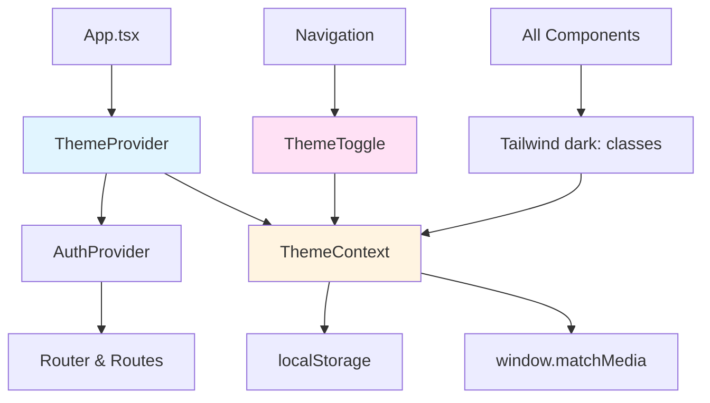
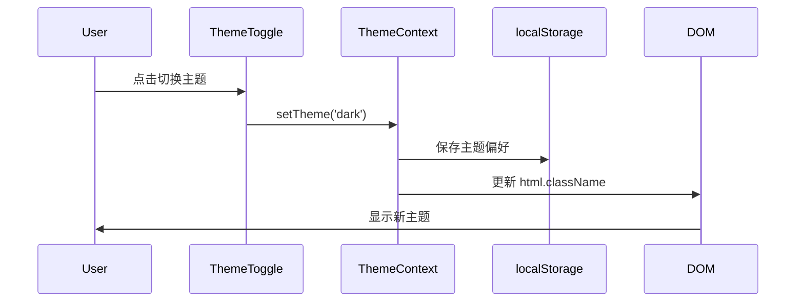
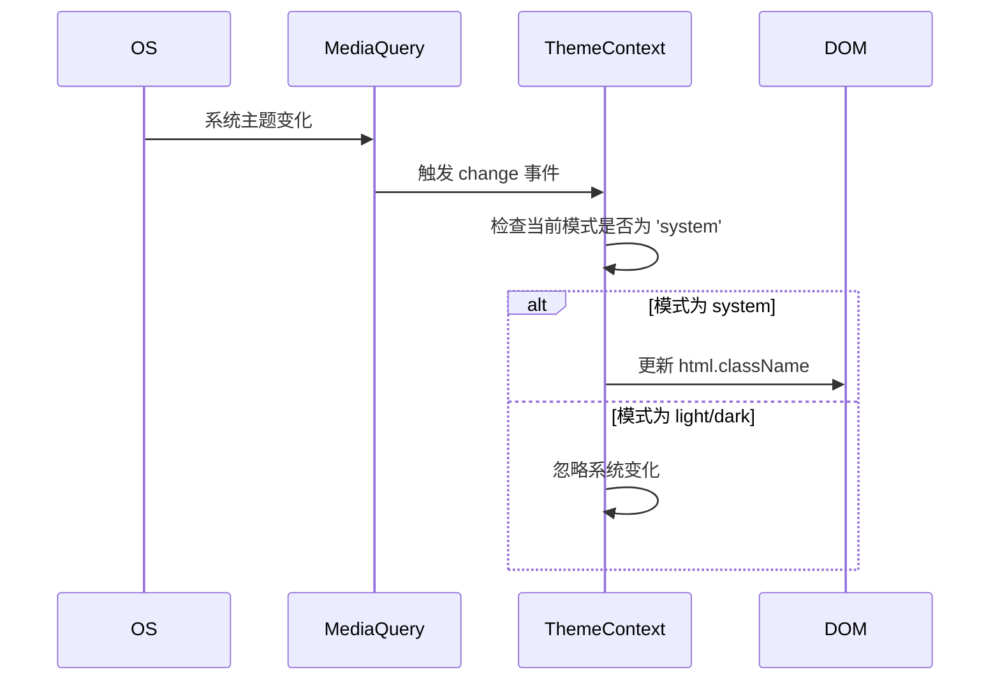

# 设计文档

## 概述

本设计文档描述了为股票投资组合追踪应用添加主题支持功能的技术实现方案。该功能将使用 Tailwind CSS 的 dark mode 功能、React Context API 和浏览器本地存储来实现亮色、深色和跟随系统三种主题模式。

设计遵循以下核心原则：
- 与现有架构保持一致（使用 Context API 模式，类似 AuthContext）
- 最小化对现有组件的侵入性修改
- 提供类型安全的 TypeScript 实现
- 确保性能优化，避免不必要的重渲染
- 支持未来扩展（如添加更多主题或自定义颜色）

## 架构

### 整体架构图



### 主题切换流程



### 系统主题监听流程



## 组件和接口

### 1. ThemeContext

**职责：** 提供全局主题状态管理和主题切换逻辑

**接口定义：**

```typescript
// src/contexts/ThemeContext.tsx

type ThemeMode = 'light' | 'dark' | 'system';
type ResolvedTheme = 'light' | 'dark';

interface ThemeContextType {
  // 当前用户选择的主题模式
  mode: ThemeMode;
  
  // 实际应用的主题（解析 system 后的结果）
  resolvedTheme: ResolvedTheme;
  
  // 设置主题模式
  setTheme: (mode: ThemeMode) => void;
}
```

**实现要点：**

1. 使用 `useState` 管理 `mode` 状态
2. 使用 `useEffect` 监听系统主题变化（通过 `window.matchMedia('(prefers-color-scheme: dark)')`）
3. 使用 `useEffect` 在主题变化时更新 DOM（`document.documentElement.classList`）
4. 使用 `localStorage` 持久化用户偏好（key: `theme-preference`）
5. 初始化时按优先级加载：localStorage > system preference > 'system' 默认值

**状态管理逻辑：**

```typescript
// 伪代码示例
const getResolvedTheme = (mode: ThemeMode): ResolvedTheme => {
  if (mode === 'system') {
    return window.matchMedia('(prefers-color-scheme: dark)').matches 
      ? 'dark' 
      : 'light';
  }
  return mode;
};

// 在 useEffect 中应用主题
useEffect(() => {
  const resolved = getResolvedTheme(mode);
  const root = document.documentElement;
  
  if (resolved === 'dark') {
    root.classList.add('dark');
  } else {
    root.classList.remove('dark');
  }
}, [mode, systemTheme]);
```

### 2. ThemeProvider

**职责：** 包装应用并提供 ThemeContext

**实现要点：**

1. 在 `App.tsx` 中作为最外层 Provider（在 `AuthProvider` 之外）
2. 确保在首次渲染前应用主题，避免闪烁（使用 `useLayoutEffect` 或内联脚本）

**组件结构：**

```typescript
export const ThemeProvider: React.FC<{ children: ReactNode }> = ({ children }) => {
  // 状态和逻辑实现
  return (
    <ThemeContext.Provider value={value}>
      {children}
    </ThemeContext.Provider>
  );
};
```

### 3. ThemeToggle 组件

**职责：** 提供用户界面来切换主题

**接口定义：**

```typescript
// src/components/ThemeToggle.tsx

interface ThemeToggleProps {
  // 可选：控制显示样式（图标 + 文字 或 仅图标）
  variant?: 'full' | 'icon-only';
}
```

**UI 设计：**

- 使用下拉菜单或按钮组显示三个选项
- 每个选项配有图标：
  - Light: Sun 图标（来自 lucide-react）
  - Dark: Moon 图标
  - System: Monitor 或 Laptop 图标
- 当前激活的选项有视觉高亮
- 支持键盘导航和屏幕阅读器

**实现方案：**

使用 Radix UI 的 DropdownMenu 组件（与现有 Dialog 组件库一致）：

```typescript
import * as DropdownMenu from '@radix-ui/react-dropdown-menu';
import { Sun, Moon, Monitor } from 'lucide-react';

const ThemeToggle: React.FC<ThemeToggleProps> = ({ variant = 'full' }) => {
  const { mode, setTheme } = useTheme();
  
  return (
    <DropdownMenu.Root>
      <DropdownMenu.Trigger>
        {/* 触发按钮 */}
      </DropdownMenu.Trigger>
      <DropdownMenu.Content>
        <DropdownMenu.Item onClick={() => setTheme('light')}>
          <Sun /> Light
        </DropdownMenu.Item>
        <DropdownMenu.Item onClick={() => setTheme('dark')}>
          <Moon /> Dark
        </DropdownMenu.Item>
        <DropdownMenu.Item onClick={() => setTheme('system')}>
          <Monitor /> System
        </DropdownMenu.Item>
      </DropdownMenu.Content>
    </DropdownMenu.Root>
  );
};
```

### 4. useTheme Hook

**职责：** 提供便捷的主题访问接口

**接口定义：**

```typescript
// src/hooks/useTheme.ts

export const useTheme = (): ThemeContextType => {
  const context = useContext(ThemeContext);
  if (!context) {
    throw new Error('useTheme must be used within a ThemeProvider');
  }
  return context;
};
```

## 数据模型

### 主题配置

主题配置通过 Tailwind CSS 配置文件定义：

```javascript
// tailwind.config.js

module.exports = {
  darkMode: 'class', // 使用 class 策略
  content: [
    "./src/**/*.{js,jsx,ts,tsx}",
    "./public/index.html"
  ],
  theme: {
    extend: {
      colors: {
        // 自定义颜色变量（如需要）
        background: {
          light: '#ffffff',
          dark: '#1a1a1a',
        },
        surface: {
          light: '#f9fafb',
          dark: '#2d2d2d',
        },
        // ... 其他颜色
      },
    },
  },
  plugins: [],
};
```

### 本地存储数据结构

```typescript
// localStorage key: 'theme-preference'
// value: 'light' | 'dark' | 'system'

interface StoredThemePreference {
  mode: ThemeMode;
  // 可选：存储时间戳，用于未来的迁移或分析
  timestamp?: number;
}
```

## 样式实现策略

### Tailwind Dark Mode 类名模式

所有组件将使用 Tailwind 的 `dark:` 前缀来定义深色主题样式：

```tsx
// 示例：卡片组件
<div className="bg-white dark:bg-gray-800 text-gray-900 dark:text-gray-100">
  <h2 className="text-blue-600 dark:text-blue-400">Title</h2>
  <p className="text-gray-600 dark:text-gray-300">Content</p>
</div>
```

### 组件样式更新策略

按优先级更新现有组件：

1. **高优先级**（核心布局和导航）：
   - Layout.tsx
   - Navigation.tsx
   - 登录/注册页面

2. **中优先级**（主要功能组件）：
   - Dashboard 相关组件
   - Holdings 相关组件
   - 图表组件（AllocationPieChart, HistoricalPerformanceChart）

3. **低优先级**（辅助组件）：
   - LoadingSpinner
   - ErrorAlert
   - 其他工具组件

### 颜色对比度保证

确保所有文本和背景组合满足 WCAG AA 标准（对比度 ≥ 4.5:1）：

- 亮色主题：深色文字（gray-900）+ 浅色背景（white, gray-50）
- 深色主题：浅色文字（gray-100）+ 深色背景（gray-900, gray-800）
- 强调色：调整亮度以在两种主题下都可读（如 blue-600 → blue-400）

## 图表组件主题适配

### Recharts 主题配置

为图表库（Recharts）提供主题感知的配色方案：

```typescript
// src/utils/chartTheme.ts

export const getChartColors = (theme: ResolvedTheme) => {
  return theme === 'dark' ? {
    text: '#e5e7eb',      // gray-200
    grid: '#374151',      // gray-700
    tooltip: '#1f2937',   // gray-800
    colors: [
      '#60a5fa',          // blue-400
      '#34d399',          // emerald-400
      '#fbbf24',          // amber-400
      '#f87171',          // red-400
      '#a78bfa',          // violet-400
    ],
  } : {
    text: '#1f2937',      // gray-800
    grid: '#e5e7eb',      // gray-200
    tooltip: '#ffffff',   // white
    colors: [
      '#3b82f6',          // blue-500
      '#10b981',          // emerald-500
      '#f59e0b',          // amber-500
      '#ef4444',          // red-500
      '#8b5cf6',          // violet-500
    ],
  };
};
```

在图表组件中使用：

```typescript
const AllocationPieChart: React.FC = () => {
  const { resolvedTheme } = useTheme();
  const colors = getChartColors(resolvedTheme);
  
  return (
    <ResponsiveContainer>
      <PieChart>
        <Pie data={data} fill={colors.colors[0]} />
        {/* 使用主题颜色 */}
      </PieChart>
    </ResponsiveContainer>
  );
};
```

## 错误处理

### 1. localStorage 不可用

```typescript
const saveThemePreference = (mode: ThemeMode) => {
  try {
    localStorage.setItem('theme-preference', mode);
  } catch (error) {
    console.warn('Failed to save theme preference:', error);
    // 降级：仅在内存中保持状态，不持久化
  }
};
```

### 2. matchMedia 不支持

```typescript
const getSystemTheme = (): ResolvedTheme => {
  if (typeof window === 'undefined' || !window.matchMedia) {
    return 'light'; // 默认亮色主题
  }
  
  return window.matchMedia('(prefers-color-scheme: dark)').matches 
    ? 'dark' 
    : 'light';
};
```

### 3. 主题闪烁问题

在 `public/index.html` 中添加内联脚本，在页面加载前应用主题：

```html
<script>
  (function() {
    const theme = localStorage.getItem('theme-preference') || 'system';
    const isDark = theme === 'dark' || 
      (theme === 'system' && window.matchMedia('(prefers-color-scheme: dark)').matches);
    
    if (isDark) {
      document.documentElement.classList.add('dark');
    }
  })();
</script>
```

## 测试策略

### 单元测试

使用 Jest 和 React Testing Library 测试：

1. **ThemeContext 测试**：
   - 默认主题加载
   - 主题切换功能
   - localStorage 持久化
   - 系统主题监听

2. **ThemeToggle 组件测试**：
   - 渲染三个主题选项
   - 点击切换主题
   - 当前主题高亮显示
   - 键盘导航

3. **useTheme Hook 测试**：
   - 在 Provider 外使用时抛出错误
   - 正确返回主题状态

### 集成测试

1. **主题持久化测试**：
   - 设置主题 → 刷新页面 → 验证主题保持

2. **系统主题跟随测试**：
   - 模拟系统主题变化
   - 验证应用主题自动更新（仅在 system 模式下）

3. **组件主题适配测试**：
   - 遍历主要页面
   - 验证所有组件在两种主题下正确渲染

### 视觉回归测试

使用 Storybook 或截图对比工具：

1. 为主要组件创建亮色和深色主题的快照
2. 在 CI/CD 中自动检测视觉变化

### 手动测试清单

- [ ] 在 Chrome、Firefox、Safari 中测试主题切换
- [ ] 测试移动端响应式布局
- [ ] 验证所有页面的颜色对比度
- [ ] 测试键盘导航和屏幕阅读器支持
- [ ] 验证图表在两种主题下的可读性
- [ ] 测试系统主题变化时的自动更新

## 性能考虑

### 1. 避免不必要的重渲染

使用 `useMemo` 缓存 context value：

```typescript
const value = useMemo(
  () => ({ mode, resolvedTheme, setTheme }),
  [mode, resolvedTheme]
);
```

### 2. 延迟加载主题切换组件

ThemeToggle 组件可以使用 React.lazy 延迟加载（如果包含大量图标或样式）。

### 3. CSS 类切换优化

直接操作 `document.documentElement.classList` 比通过 React 状态触发全局重渲染更高效。

### 4. 减少 localStorage 访问

仅在主题变化时写入 localStorage，读取仅在初始化时进行一次。

## 可访问性

### ARIA 属性

```tsx
<button
  aria-label="Toggle theme"
  aria-expanded={isOpen}
  aria-haspopup="menu"
>
  {/* 图标 */}
</button>
```

### 键盘导航

- Tab: 聚焦到主题切换按钮
- Enter/Space: 打开主题菜单
- Arrow keys: 在选项间导航
- Enter: 选择主题
- Escape: 关闭菜单

### 屏幕阅读器支持

- 为图标提供文字标签
- 使用语义化 HTML 元素
- 提供当前主题的状态通知

## 未来扩展

### 1. 自定义主题

预留接口支持用户自定义颜色：

```typescript
interface CustomTheme {
  primary: string;
  secondary: string;
  background: string;
  // ...
}

interface ThemeContextType {
  // ... 现有属性
  customTheme?: CustomTheme;
  setCustomTheme?: (theme: CustomTheme) => void;
}
```

### 2. 主题预设

提供多个预设主题（如"蓝色"、"绿色"、"紫色"）：

```typescript
type ThemePreset = 'default' | 'ocean' | 'forest' | 'sunset';
```

### 3. 动画过渡

添加主题切换时的平滑过渡动画：

```css
* {
  transition: background-color 0.3s ease, color 0.3s ease;
}
```

### 4. 服务器端同步

如果未来添加用户账户设置同步，可以将主题偏好存储到后端。

## 技术决策记录

### 为什么选择 Tailwind dark mode 而不是 CSS 变量？

- **优势**：
  - 与现有 Tailwind 配置无缝集成
  - 类型安全（通过 TypeScript）
  - 更好的 IDE 支持和自动补全
  - 更小的运行时开销

- **劣势**：
  - 需要为每个元素添加 `dark:` 类
  - 不如 CSS 变量灵活（但对当前需求足够）

### 为什么使用 Context API 而不是状态管理库？

- 主题状态简单，不需要复杂的状态管理
- 与现有 AuthContext 保持一致
- 减少依赖和包大小
- 足够满足性能需求

### 为什么在 HTML 中添加内联脚本？

- 避免主题闪烁（FOUC - Flash of Unstyled Content）
- 确保在 React 渲染前应用主题
- 这是业界标准做法（Next.js、Gatsby 等都采用）
